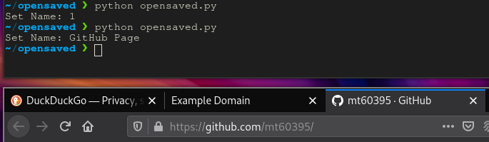

# opensaved
## Description

Simple Python script to open saved links.

## Installation
Make sure you have Python installed. Modify the config.json file to include links. Make sure the commas are present (one link set doesn't need any) in the correct places.

`"link-set":["link", "optional-other-links"] (COMMA)`

## Usage

Run `opensaved.py` and enter the set name to open up the links in that set.

Note that your default web browser is used, and you can modify this as you wish to include a specific browser if you know what you're doing.

